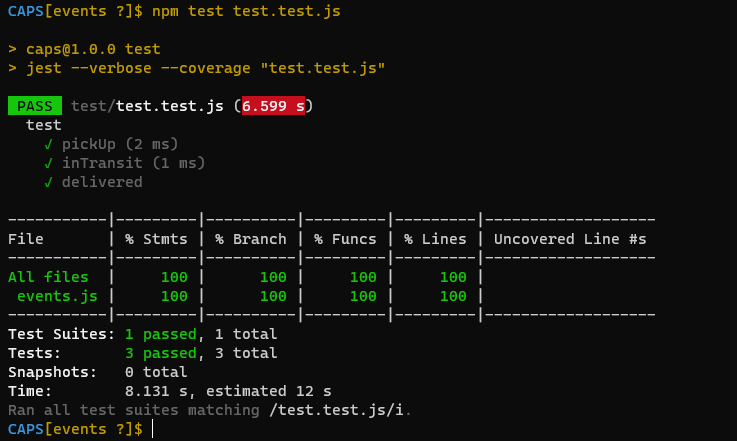
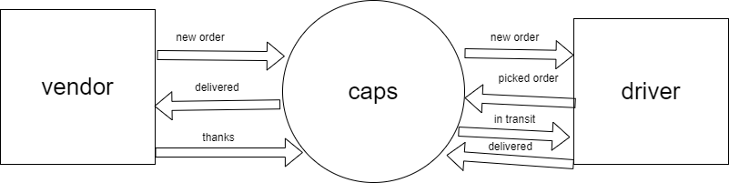

# lab 11 -caps 
(4-Phase CAPS system, written in Node.js.)

## Event Driven Applications

### Author: Neveen Beiram

- [PR](https://github.com/NeveenBeiram/CAPS/pulls)

- [Actions](https://github.com/NeveenBeiram/CAPS/actions)

### SetUp
- clone
- .env 

    STORE --> 'store-name'

- npm i 
- Running the app
   
    --> `node caps.js`
    
    or nodemone or npm start

### Test
`npm test test.test.js `

### uml

